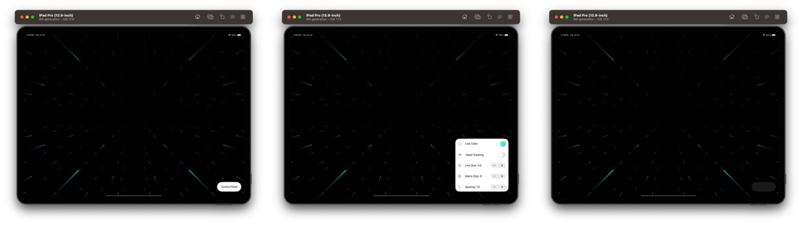
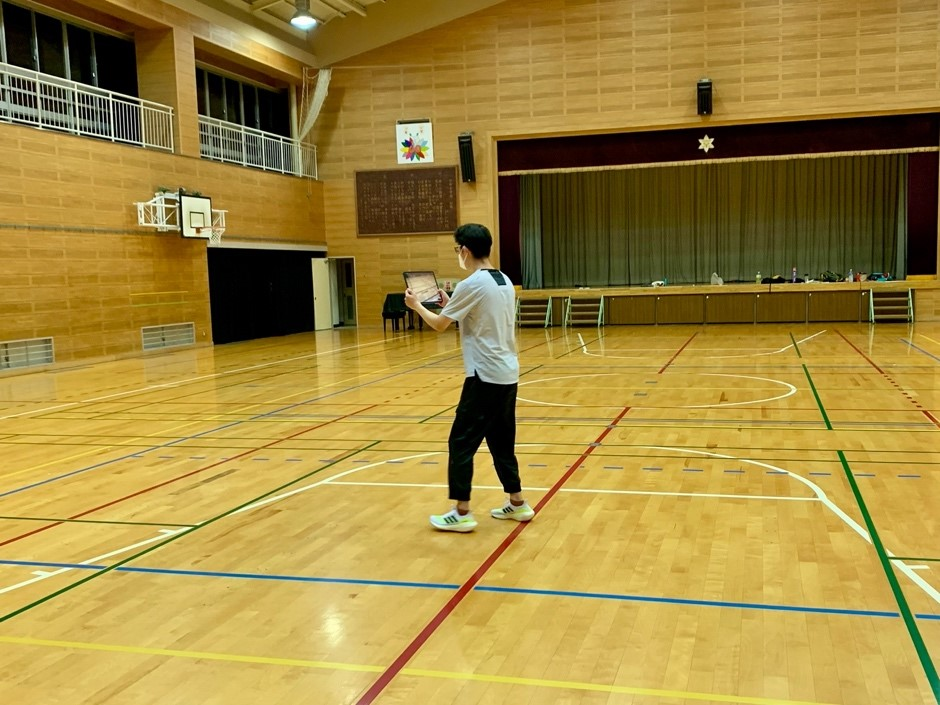

# MLs: An iOS AR App

## Overview
"MLs" (short for Motion Lines) is an innovative iOS AR application developed to address cybersickness in VR environments. Utilizing Apple's ARKit, MLs offers a seamless augmented reality experience where digital content overlays the real world, enhancing the user’s sensory perception.

 
<em>The Three States of the MLs Control Panel on iPad Pro 12.9-inch</em>

 
<em>Preliminary Experiment in a Gym Using the App</em>

## Features
- **Interactive Control Panel**: Built with SwiftUI and SF Symbols for an aesthetically pleasing interface. Designed for easy manipulation in any orientation on large devices like the iPad Pro 12.9-inch.
- **Capsule State**: The default minimal interface.
- **Expanded State**: Access detailed menu interfaces to adjust parameters by swiping up.
- **Hidden State**: Double-tap to hide the control panel for an unobstructed view of motion lines.

## Functionality
- Users control motion lines through parameters: Line Size, Matrix Size, and Spacing.
- Motion lines designed to mimic visual streaks observed when tracking a moving object, appearing teardrop-shaped.
- Motion lines are stored in a matrix and move with the user’s device.

## Visual Design
- Utilizes calming cyan color (RGB: 0,255,255, #00FFFF) based on color research, aiming to create a pleasant visual experience.
- Motion lines aim to provide enhanced visual cues without causing sensory conflict.

## How to Use
1.	Open the App on your iOS device.
2.	Use the control panel to adjust the motion lines’ appearance.
3.	Double-tap to toggle the visibility of the control panel.

## Research Basis
The App is part of a research study focused on reducing VR sickness by leveraging the concept of motion lines and augmented reality.

The App is part of a research study aimed at reducing VR sickness by using motion lines.  The study introduces the Line Effect, a novel peripheral visual effect to mitigate cybersickness without disrupting the natural VR experience.  A preliminary experiment conducted with the MLs App evaluated various motion line arrangements, leading to the identification of an optimal configuration.  This configuration was then tested in VR, demonstrating significant reductions in cybersickness and improved user experience.

[Research Report Download](https://drive.google.com/file/d/1yxPIE7ruP1nEx6b3l1g3n-zT26zpN-XS/view?usp=share_link) 
[Research Overview Download](https://drive.google.com/file/d/1EIDYY1DrOviFCu-5gos2_iJj2YyCfPlu/view?usp=share_link)
